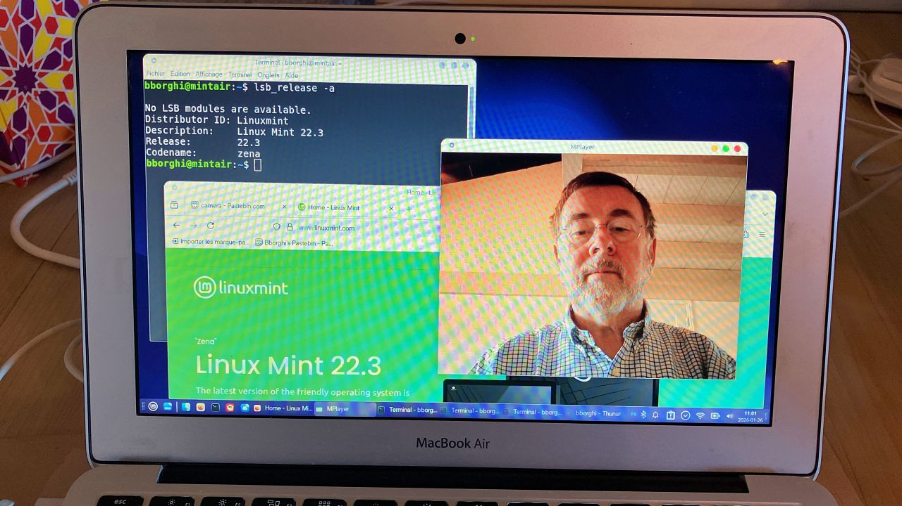
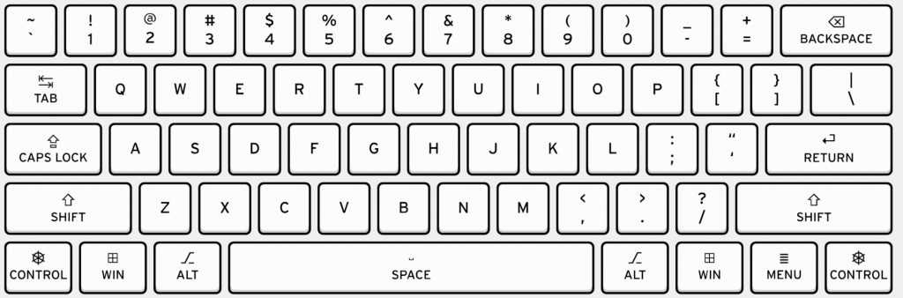

# How to Install Linux Mint 22 on a 2014 MacBook Air – Step-by-Step Guide with Fixes for Wi-Fi, Camera & Trackpad (2026 Update)

My old MacBook Air 11" (2014) running macOS Catalina was so slow that I finally decided to install Linux on its hard drive to make it a decent machine again.  

I thought it would be easy and pretty well documented on the Web. It happens that there are some traps and that the documentation is scattered. This is a detailed report of my journey. I won't go in every details.



## Linux Installation: Overview

1. Choose a suitable Linux distribution
2. Create a bootable USB drive
3. Prepare the MacBook hard drive for dual-boot
4. Boot on the USB drive
5. Install Linux on the hard drive
6. Boot the newly installed operating system
7. Set up the Wifi connection
8. Fix the keyboard
9. Make the camera work
10. (Optional) Customize appearance and behavior

## Step 1: Choose a suitable Linux distribution

There are a lot of Linux distributions and most of them are suitable to install on an old macbook. I wanted a lightweight, well-known distribution that brings back performance to my old hardware. There are [many choices](https://mactel-linux.org/distributions/the-best-linux-distros-for-intel-macs-tested-in-2025/). I chose [**Linux Mint XFCE**](https://www.linuxmint.com) that is known for its stability and being light on resource usage.

On your main machine, go to the [Linux Mint download page](https://www.linuxmint.com/download.php) and download the XFCE Edition iso image. At the time of writing the current version is 22.3 and the iso image takes around 3 GB.

## Step 2: Create a bootable USB drive

- Find a USB drive with a capacity at least 8 GB. The initial contents of the USB drive will be wiped out during the process, so backup its contents if needed.
- Insert the USB drive in a USB port of your main machine.
- On your main machine, use **[balenaEtcher](https://etcher.balena.io/#download-etcher)** to flash the Linux Mint ISO image to the USB stick.

## Step 3: Prepare the MacBook  hard drive for dual boot

Although I wanted to use this MacBook Air only with Linux, I decided to stay on the safe side and make a dual-boot installation, so that rollback would be possible. I mad a fresh reinstall of macOS so that all the old data are erased, letting plenty of space for Linux.

- Erase current data:
  - Restart your MacBook by pressing the power button and holding down  <kbd>⌘</kbd> + <kbd>R</kbd> to activate Recovery Mode.
  - In the first window, select *Reinstall macOS*. Follow the process of installation.
  - When you first log in in the newly installed macOS, it will ask for installing updates and/or new version of macOS. Do that only if you plan to use macOS on this MacBook.
- Create a partition for Linux:
  - Restart your MacBook by pressing the power button and holding down  <kbd>⌘</kbd> + <kbd>R</kbd> to activate Recovery Mode.
  - In the first window, select *Disk Utility*.
  - With Disk Utility, resize the current APFS partition down to 50 GB and create a new exFAT partition for Linux (at least 30 GB) - the Linux installation will make it an ext4 partition later.
- Turn the MacBook off.

**Note:** Many [tutorials](https://mactel-linux.org/installation/dual-boot-like-a-pro-macos-and-linux-on-a-macbook-pro-2012-2019/) suggest to install [the rEFInd Boot Manager](https://www.rodsbooks.com/refind/) to manage dual-boot. I did not install it and I don't miss it. The native Apple boot manager is enough for me.

**Note:** If your Mac is still on HFS+ (pre-High Sierra), some sources say that you'll may have to convert to APFS first via Disk Utility before resizing.

## Step 4: Boot on the USB drive

- Insert the USB stick into one of the MacBook USB ports.
- Restart your MacBook by pressing the power button and holding down the <kbd>option/alt</kbd> key. Double click on the USB stick icon (any of the yellow icons). The system should boot into the GRUB menu.
  - Don’t try to connect to a wireless network, because it won’t work at this time of installation.
- **Here is the tricky part.** If you directly start Linux Mint, you won't be able to select the hard disk drive on which you would like to install Linux. You have to add a boot option.
  - While in the main GRUB menu, press <kbd>e</kbd> to edit the commands before booting.
  - In the line starting with ```linux```, add the option ```intel_iommu=off```, for instance between the ```quiet``` and ```splash``` options.
  - Then press <kbd>F10</kbd> to boot.
  - Check that the MacBook hard drive is detected : launch ```Applications > System > Gparted```- you should see your target partition. You can format this partition to use the ```ext4```file system which is the standard Linux file system.

**Note: it's even a little trickier when your MacBook keyboard has a non-US layout.**

- In my case, my MacBook has a French Macintosh layout. That means that when editing the Grub options, for instance, if I hit the <kbd>_</kbd> key, it enters ```+```. So to enter correctly the option ```intel_iommu=off```, I had to type ```intel°io,,u-off```.

- Here is the standard QWERTY layout, so that you can easily map the keys if your MacBook has a non-US keyboard..

    

**Credit:** The ```intel_iommu=off``` trick is mentioned [here](https://askubuntu.com/questions/1212573/ubuntu-installer-wont-recognize-my-ssd-on-macbook-air/).

## Step 5: Install Linux on the hard drive

- Now you can click on the **Install Linux Mint** icon on the top left corner of the desktop to launch the installer. Go through and complete [the installation process](https://linuxmint-installation-guide.readthedocs.io/en/latest/install.html). It takes some time.
- At the end of installation process, click restart when prompted.

## Step 6: Boot the newly installed operating system

At this stage, if you boot Linux on the hard drive, you get something like this:

```sh
Gave up waiting for root device. Common problems:
- Boot args (cat /proc/cmdline)
- Check rootdelay= (did the system wait long enough?)
- Check root= (did the syste, wait for the right device?)
- Missing modules (cat /proc/modules; ls /dev)
ALERT! /dev/disk/by-uuid/9642068f-d6fa-461e-918e-f20d0ac9a88f does not exist. Dr
opping to a shell!

BusyBox v1.10.2 (Ubuntu 1:1.10.2-1ubuntu6) built-in shell (ash)
Enter 'help' for a list of built-in commands.

(initramfs)
```

The MacBook does not boot up properly and instead of going to the login screen, drops through to a initramfs command line prompt.

**Here is the second tricky part:**  you need to edit the Grub options, otherwise the hard drive is not detected.

- For that, you need to boot again on the USB stick.
- Launch again ```gparted``` and note the name of the hard drive partition on which Linux has been installed. For instance: ```/dev/sda3```.
- Start a terminal and mount the partition (adapt to the actual partition name).

```sh
sudo mount /dev/sda3 /mnt
```

- [Edit the grub option file](https://askubuntu.com/questions/19486/how-do-i-add-a-kernel-boot-parameter) **on the hard drive**.

```sh
sudo nano /mnt/etc/default/grub
```
  
- Update the ```GRUB_CMDLINE_LINUX_DEFAULT``` variable

  ```GRUB_CMDLINE_LINUX_DEFAULT="quiet intel_iommu=off splash"```
  
- Save the file and exit from the editor.

- Apply the new options

```sh
sudo update-grub
```

- Restart the MacBook. Remove the USB stick when prompted.

This time, the MacBook boots up properly the Linux system on the hard drive. Celebrate.

**Note:** if the MacBook has a non-US keyboard layout, you can specify the proper layout with the ```setkxkbmap``` command in a terminal before editing the grub option file.

For instance, [for a French Macintosh layout](https://commandmasters.com/commands/setxkbmap-linux/):

```sh
setxkbmap -layout fr -variant mac
```

## Step 7: Set up the Wifi connection

Ok, your MacBook runs Linux, but it is cut from the rest of the world. It is time to set up the Wifi.

You need to install the driver for the built-in Broadcom wireless network card.

- Click on the *Let’s go!* button in the window of the Welcome up that is open on your desktop.
- Navigate to launch the *Driver Manager*.
- The Driver Manager observes that you appear to be offline and ask to insert the USB stick you used to install the system.
- Once the installation media is mounted, several options are shown. Select *broadcom-sta-dkms*, then click  *Apply Changes*. Authenticate when needed.
- Restart when prompted.
- Once the MacBook is started again, you can log in and connect to the wifi network of your choice.

**NOTE**: Depending on the exact model of your MacBook Air 2014,  ```broadcom-sta-dkms``` may not work. You can try ```bcmwl-kernel-source``` or ```b43-fwcutter + firmware-b43-installer``` instead.

## Step 8: Fix the keyboard

### Fix the inversion of the <kbd>@ #</kbd> and <kbd>< ></kbd> keys
After the fresh install of Linux Mint, when I want to type "@", I obtain "<" and vice-versa. Idem when typing "#", I obtain ">" and vice-vera. Not  a big deal, but still an annoyance. This inversion is a common problem with French Apple keyboards on Linux, due to incorrect ANSI/ISO detection. 

To fix it, you need to configure the options of the `hid_apple` kernel module, which manages Apple keyboards on Linux. The `/etc/modprobe.d/` directory is used to load module options at startup.

Run:
```sh
sudo echo "options hid_apple iso_layout=1" >> /etc/modprobe.d/hid_apple.conf
sudo update-initramfs -u -k all
sudo reboot
```

Runnnig `update-initramfs` regenerates the `initramfs` file that is used by the boot process. This update ensures persistence. Without this step, the changes in `/etc/modprobe.d/` do not apply at the very beginning of boot, which appears to be especially important for a MacBook's built-in keyboard. And you need to reboot fot the changes to apply.

### Backlit keyboard

The keyboard backlight is already enabled in the standard distribution. You can adjust the brightness or turn it on and off by using the <kbd>F5</kbd> and <kbd>F6</kbd> keys.

### Third level chooser key

There are some useful characters not directly available on the French keyboard in its Macintosh variant. With macOS, to type a left bracket "[", the key combination is <kbd>Command</kbd> + <kbd>Shift</kbd> + <kbd>(</kbd>. It does not work in Linux Mint and it took me some time to understand how to type a left bracket.

In Linux, <kbd>Shift</kbd> is the second level input modifier key (2nd level chooser key). By default, the  third level input modifier key (3rd level chooser) is  <kbd>AltGr</kbd> (same as Windows). On a MacBook keyboard, <kbd>AltGr</kbd> is the **right** <kbd>Alt</kbd> key. So to get a left bracket, the key combination is **right** <kbd>Alt</kbd> + <kbd>Shift</kbd> + <kbd>(</kbd>. To get a left brace "{", the key combination is **right** <kbd>Alt</kbd> + <kbd>(</kbd>. 

As an habitual macOS user, I have muscle memory and I wanted a more mac-like experience. Then I customized the 3rd level chooser key to be **left** <kbd>Command</kbd>:

```sh
setxkbmap -option lv3:lwin_switch
```

To make this change permanent, you need to edit the ```/etc/default/keyboard``` file, modify the line setting XKBOPTIONS, then reboot:

```sh
XKBOPTIONS="lv3:lwin_switch"
```

To know the current active active options of your keyboard, run:
```sh
setxkbmap -query
```

The list of all the available opions is in the file ```/usr/share/X11/xkb/rules/evdev.lst```.


## Step 9: Make the camera work

You're almost done. If you plan to use your MacBook for videoconferencing, there is one step left : enable the camera.

For that, you have to build and install [the facetimehd driver available on GitHub](https://github.com/patjak/facetimehd).

The detailed instructions are [here](https://github.com/patjak/facetimehd/wiki/Installation). You have to follow them strictly, but there is no trick. Check the section *Get Started on Debian*, that specifies the dependencies to install beforehand.

To test the installation, you have to install mplayer.

```sh
sudo apt install mplayer
```

And then you can run:

```sh
mplayer tv://
```

The camera works.

**Note:** There seems to be a simpler method with **facetimehd-dkms**.

```sh
sudo apt update
sudo apt install facetimehd-dkms facetimehd-firmware
sudo modprobe facetimehd
```

## Step 10 (optional): Customize appearance and behavior

### Theme

[WhiteSur](https://github.com/vinceliuice) is a relatively recent macOS-like theme.

- Download and install the various theme components.

```sh
sudo apt update
sudo apt install git sassc libglib2.0-dev libxml2-utils

# Download WhiteSur for GTK + XFCE
git clone --depth=1 https://github.com/vinceliuice/WhiteSur-gtk-theme.git

# Install the light theme
cd WhiteSur-gtk-theme
./install.sh -c light

# Dowload and install the icons
cd ..
git clone --depth=1 https://github.com/vinceliuice/WhiteSur-icon-theme.git
cd WhiteSur-icon-theme
./install.sh

# Install macOS-like fonts
sudo apt install fonts-inter fonts-jetbrains-mono
```

- Move the theme from a user directory to a shared directory, so that more applications apply the theme (for instance: terminal)

```sh
sudo mv ~/.themes/* /usr/share/themes
```

- Launch ```Applications > Parameters > Appearence```
- Select:
  - Style: *WhiteSur-Light*
  - Icons: *WhiteSur-light*
  - Fonts: Default *Inter Display Regular*, Monospace *JetBrains Mono Regular*

Some authors suggest to install ```plank``` to have a dock-like experience. I do not like it and I stay with the taskbar.

### Trackpad

The default touchpad driver is *libinput*. For more control over the click zone on the trackpad, you can switch to *synaptics*.

I suggest you test the default *libinput* driver first. Switch to *synaptics* *only if multitouch or click zones feel off.

- To know which driver is used by your input devices, run the following command:

```sh
grep -i "Using input driver" /var/log/Xorg.0.log
```

​  When both drivers are installed, *synaptics* takes priority.

- To install the *synaptics* driver:

```sh
apt install xserver-xorg-input-synaptics
```

​  Then log out and log back in.

- Configure the desired behavior:

```sh
sudo mkdir -p /etc/X11/xorg.conf.d
sudo nano /etc/X11/xorg.conf.d/70-synaptics.conf
```

Insert these lines (adapt to your needs):

```text
Section "InputClass"
    Identifier "Apple Trackpad"
    MatchProduct "bcm5974"
    Driver "synaptics"
    Option "TapButton1" "1"          # 1 finger = left click
    Option "TapButton2" "3"          # 2 fingers = right click (fallback)
    Option "TapButton3" "2"          # 3 fingers = middle
    Option "ClickFinger1" "1"
    Option "ClickFinger2" "3"
    Option "ClickFinger3" "2"
    Option "VertEdgeScroll" "on"
    Option "HorizEdgeScroll" "on"
    Option "RTCornerButton" "0"      # top right = disabled
    Option "RBCornerButton" "3"      # bottom right = right click
    Option "LBCornerButton" "1"      # bottom left = left
    Option "TapAndDragGesture" "on"
    Option "LockedDrags" "off"
EndSection
```
